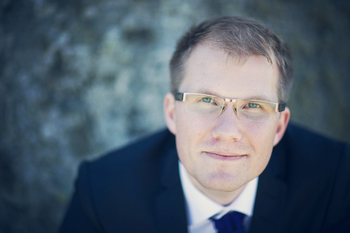

# Welcome
{: .right}
I am an engineer, and I'm proud of it! My field is in applied physics and electrical engineering,
and I am currently living and working in Linköping, Sweden. You can read more in my [CV (swedish)](CV_sv.pdf).

> Simplicity is never easy. It comes from hard work and repeated renewal.
> To make a complex product simple requires powerful fundamental concepts
> which one must dare to replace when you discover new patterns, new concepts
> that will take you farther. Sometimes the gear you wear will lead you on, sometimes
> you need to leave things behind.

## This Website
Here you find texts and documentation related to projects I'm working on.
Though the projects themselves may be long-stretching and advanced, I continously struggle
to make them simple at their core, while building my understanding for the field.

This website in itself is built on less than 150 lines of code, excluding
content, apache configuration and the like, but including for example the following features:

 - [Markdown to html](https://pypi.python.org/pypi/Markdown)
 - [UML generation](http://plantuml.sourceforge.net/)
 - [Source code highlighting](http://pygments.org/)
 - Automatic menu generation
 - Template system
 - etc.

[Source code is available on github](https://github.com/jonatanolofsson/simplestupid.se)
