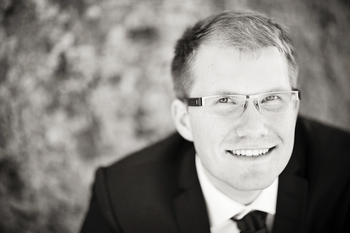
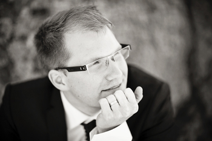

# About Me
{: .right}
I have always been in love with engineering. Like so many others who grew up to 
be engineers, I was the guy who built stuff, took things apart and 
(tried to) put things together again, just for the fun of it.
I started programming around the age of 10, and have quite frankly had some time to practice!
But I also was the guy who should be involved everywhere, politically and 
in every school/youth board I came in contact with - and not without success.

At the university, my interest for programming, robotics and electronics grew and especially in the area of automatic control.
Togheter with my friends, we built a multitude of robots and cool stuff, some of which is included on this website.

While still at the university, I was volonteering as a support technician on [Dreamhack](http://dreamhack.se/) when [Combitech](http://combitech.se/)
ran a programming contest (lasting during the entire night). 
Stupidly enough, I got to the finals (lasting during the entire following night as well)..

My performance and education was enough to get a job offer the very same day 
I called back, having gotten home from Dreamhack.
Me and my best friend, who also competed in the same programming contest, 
started with a summer internship, building and programming a really cool robot platform, 
including LIDAR sensors and quite advanced localization algorithms.

It was great fun, and a year later we were able to take it [a step further](03.other_projects/02.mine_robots.md) and create an 
eight-man project team of last-year students who worked for half a year together with the university
to create a test deployment - simulating a mining environment - in which multiple robots could
carry out work orders while keeping clear of each other.

{: .left}
So after five years at the university, after having completed [my thesis](04.thesis.md) on time, 
I was quickly offered to enter a consultant trainee program called *Combitech Talent Program (CTP)* ,
and since I got my consultant assignment before my employment had even started, I got right out to
the customer [Autoliv](http://autoliv.com/), where I have been ever since.

Autoliv, in Linköping, is a advanced development facility in computer vision, working with major car manufacturers
to use cameras to find pedestrians, animals et.c. and to aid the driver in avoiding these.

The CTP employment is a three-part deal between Combitech, the consultant and the host customer.
I, as a consultant, get to go on *a lot* of extra courses - ranging from efficient requirement 
management and technical courses such as *Embedded Linux*, to softer courses in rhetorics and businessmanship.
After two years, I also get the oppurtunity to choose to move my employment to the host customer business.

I started my trainee program as a developer in the *Framework* team, implementing the foundations of
the embedded software including message passing, algorithm scheduling and low level drivers.

As with many projects at the forefront of technology, my project was in dire need of structure, so
after a year, I agreed to shoulder the role of Software Configuration Manager. 
This implied the responsibility of structuring the work of some 150 developers, ensuring
traceability and a swift work process. Now, a year later, I can definetly see myself having played a major role
in the large changes we have gone through, including a transition to continuous integration and with it
a full new way to integrate all team's code into *one product*.
