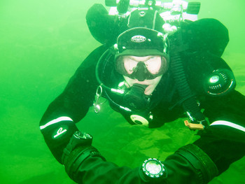

# Scuba Diving
In the fall of 2013, my close friend Erik Levholt convinced my to take the Open Water diving certificate.
In the end, he couldn't go, but I took the course anyway together with my now wife, Anna!

Even though I was anxious to learn to dive, little did I know how hooked we would become!
We both got ourselves a full diving gear, suitable for our northern waters and
now, less than a year later, we are both studying for our fifth diving course here in Linköping, to be certified as rescue divers.
Safety first, you know, so it's best to know what to do if there's an accident!

{: .left}
{: .right}
{: .left}
{: .right}
{: .right}
{: .left}
