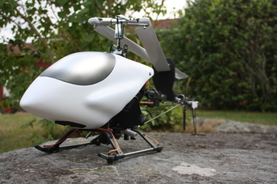

# What Is It?
{: .default}
The helicopter I've been working on for the last few years(!) is increasingly becoming a statue of my stubborn will to keep doing practical
electrical engineering combined with advanced automatic control. Although I have less time to work on the project since I met my wife, I continue
to work on the implementation details just to learn new things! Through the years, I've had the oppurtunity to do everything on the helicopter from
implementing low-level serial protocols, microprocessor serial communication drivers to designing and ordering manufactured circuit-boards.

Above all, the helicopter is a foundation for learning new techniques, new programming skills and electrical engineering.

This website is intended to be a both technical and accessible documentation of the project.

# Background
My hobby with working on a helicopter project began during my years at the univerity. 
Together with my friends, we built several robots - all under the common device of ''How Hard Can It Be?'' - and we had loads of hard work
but even more fun! During the later years, I became inspired with getting my own helicopter to fly, and began to focus my studies
toward automatic control and sensor fusion. 

# Source Control
All source code for this project is available on [my github](https://github.com/jonatanolofsson/helicopter).

# Design Overview

While the algorithms used aim to be quite advanced, the basic design of the helicopter is actually quite simple.
The lower level electrical details are handled by a microcontroller responsible for sampling sensors and feeding servo signals.
This acts as an abstraction layer against the Linux-equipped main computer, which also interacts with an identical twin which is occupied with vision processing and SLAM techniques.
They are connected through simple serial connections, and standard hardware solutions are used where possible.

The helicopter is a 650-class helicopter bought part-by-part from [HobbyKing](http://www.hobbyking.com) and the processors
are manufactured by [HardKernel](http://www.hardkernel.com) (Odroid U2 4xCortex A9 @ 1.7-2.0 GHz) and [LeafLabs](http://www.leaflabs.com) (Maple Mini, Cortex-M3 @ 72 MHz)
respectively. The vision processor uses a modified version of the [PTAM](http://www.robots.ox.ac.uk/~gk/PTAM/) library, which i developed during my Master's thesis.

{: .uml}
