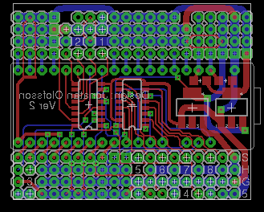

# The heliac curcuitboard
The heliac circuitboard provides a link between the higher level logic in the helicopter system and
the low level electrical signals which governs the helicopter's movements and actions.

{: .default}

The circuit mainly houses a Maple Mini STM32F1 microprocessor which is used to sample the sensors
connected to the board, and to send the servo signals to the actuators. The board is also equipped with
multiplexers for the servo signals, to enable manual servo control through standard radio link.

## Main Components
The circuitboard consists mainly of the following parts:

 - [Leaf Labs Maple Mini](http://leaflabs.com/docs/hardware/maple-mini.html)
 - 2x[74157](MUX_74157.pdf) quad 2-to-1 multiplexer
 - 5v voltage regulator
 - 3v voltage regulator

## Main Issues and Lessons Learned
Creating this circuitboard has been an iterative experience, where the first circuitboard I had fabricated was
far more elaborate, e.g. using a secondary microprocessor as a watchdog and multiplexer controller.
The next, current, iteration was made much smaller to fit better into the helicopter and reduce manufacturing consts.
Shortly thereafter, I started wiring up the servos which led me to discover the effects that the servo power drain
had on the voltage levels of the board's power supply. To avoid having the voltage drop below the threshold for the microprocessor,
capacitors had to be added to compensate for the short dips that occur periodically when the servo draws power to actuate.
