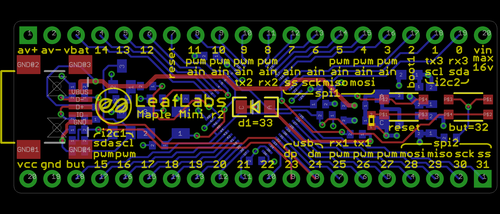

# The Maple Mini
{: .default}
Onboard the heliac circuitboard, there is a [Maple Mini](http://leaflabs.com/docs/hardware/maple-mini.html) which
samples sensor data and generates the servo signals which are sent out to control the helicopter.

## Software
The software of the Maple Mini can be divided into several modules which 
pretty much independently do their own thing.
The core of this is a list of event that are to be processed. 
To keep responsiveness up, interrupts are never active more than what is necessary 
to register an event, a function to be run in userspace. 
This list of functions is then continuously traversed, actuating the required response.

The modules which run on the Maple Mini include:
 - Sensors
     - 10DOF IMU
     - Wind sensors
     - Tachometer
- Servo actuation
- RS232 serial communication
- SPI/I2C communication

## Sensor Oversampling
The sensor module of the Maple Mini is designed to push sensor updates at 100 Hz. 
That is fast enough for state estimation and control, but it also underutilizes the potential of
the [sensors used](../02.sensors/00.onboard_sensors.md). Therefore, the available sensors are sampled at full rate - up to 2kHz - and
averaged to provide a better reading, while keeping the data transfer minimal.

## Messages
Messages from the microcontroller is sent to the main processor through RS232 serial communication.
Since both the sender and the receiver use the same memory architecture, it is possible to simply copy
the data structures used for internal storage, and send these as raw data. The receiver then uses the
very same header files to interpret the data and convert it into a typed message in the 
[helios message passing](../01.helios/00.helios.md).

The messages defined for serial communication are (as defined in sys/com/MapleMessages.hpp):

 - SensorMessage
 - ControlMessage
 - CameraControlMessage
 - IoctlMessage

## Connections
| Pin | Functionality | Comment |
|:---:|:--------------|:--------|
| 0   | Serial RX     | Serial3 |
| 1   | Serial TX     |         |
| 2   | (digital)     |         |
| 3   | (analog)      |         |
| 4   | (analog)      |         |
| 5   | (analog)      |         |
| 6   | (analog)      |         |
| 7   | (analog)      |         |
| 8   | Servo 5       | Timer 2 |
| 9   | Servo 6       |         |
| 10  | Servo 7       |         |
| 11  | Servo 8       |         |
| rst | Reset         |         |
| 12  | Watchdog      |         |
| 13  | (digital)     |         |
| 14  | (digital)     |         |
| 15  | SDA           | I2C1    |
| 16  | SCL           |         |
| 17  | (digital)     |         |
| 18  | (digital)     |         |
| 19  | (digital)     |         |
| 20  | (digital)     |         |
| 21  | (digital)     |         |
| 22  | (digital)     |         |
| 23  | (digital)     |         |
| 24  | Servo 4       | Timer 1 |
| 25  | Servo 3       |         |
| 26  | Servo 2       |         |
| 27  | Servo 1       |         |
| 28  | MOSI          | SPI2    |
| 29  | MISO          |         |
| 30  | SCK           |         |
| 31  | SS            |         |

