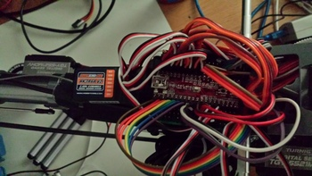

# Onboard Sensors
{: .right}
Sensors are fun! And I believe it shows considering the following list of onboard sensors:

 - [10 DOF IMU](01.imu.md)
     - 3D accelerometers
     - 3D gyroscopes
     - 3D magnetometer
     - Barometric pressure sensor
 - [Airflow sensors](02.airflow.md)
 - [10 Hz GPS](03.gps.md)
 - [Single camera Visual SLAM](04.camera.md)
 - [Optical Flow](05.optical_flow.md)
 - [Tachometer](06.tachometer.md)
 - [Tactile switches](08.tactile_switches.md)

All these sensors are fed into a non-linear Kalman filtering algorithm, 
modified to accomodate for the varying sample rates of the different sensors.

And if that's not enough, there is also a movable camera for a direct [video link](07.video_link.md) to the operator.

More information on each sensor can be found on each of the pages. When I get around to recording the data, I also intend to post
more details there on the sensor data that is received from each of the sensors.
