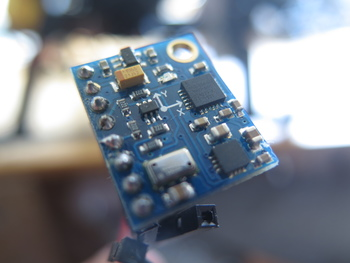

# 10DOF IMU
{: .right}
This IMU (Inertial Measurement Unit) actually measures more than just intertial properties.
The measured quantities are

 - Acceleration
 - Rotational velocity
 - Magnetic orientation
 - Air pressure

In general, magnetometer readings are often easily disturbed, and it certainly 
does not help having an electric motor nearby. Some trials will be performed to
use [mu-metals](http://en.wikipedia.org/wiki/Mu-metal) for magnetic shielding, but
the magnetometer readings are likely to be unusable.

In contrast, the acceleration and rotational velocity may be sampled at high speed
and is a central part of the localization.
