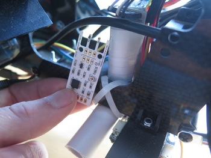

# Air flow sensors
{: .left}
The [airflow sensors](http://moderndevice.com/product/wind-sensor/) works by measuring the power
required for compensating the heat dissipation of a resistor with known thermal properties.

Since a helicopter is, by concept, moving air about, the value of this sensor is yet to be verified.
Measures have been taken to avoid the airflow from the propeller, but they are no doubt going to be affected
by it. 

However, since there are two of them mounted symmetrically in a pipe on each side of the helicopter,
the difference between the readings may still pose an interesting measure, as theoretically any shared
error will cancel out, as per

> $ \delta = \tilde{w}\_l - \tilde{w}\_r = w\_l + e\_{static} + e - w\_r - e\_{static} + e = w + 2e$
