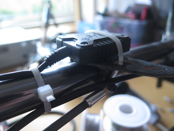

# GPS
{: .right}
The GPS used on the helicopter provides accurate readings of global 
position and velocity at the (unusually) fast rate of 10 Hz.
This allows for faster correction of drift in the localization.
