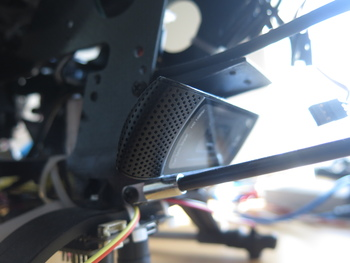
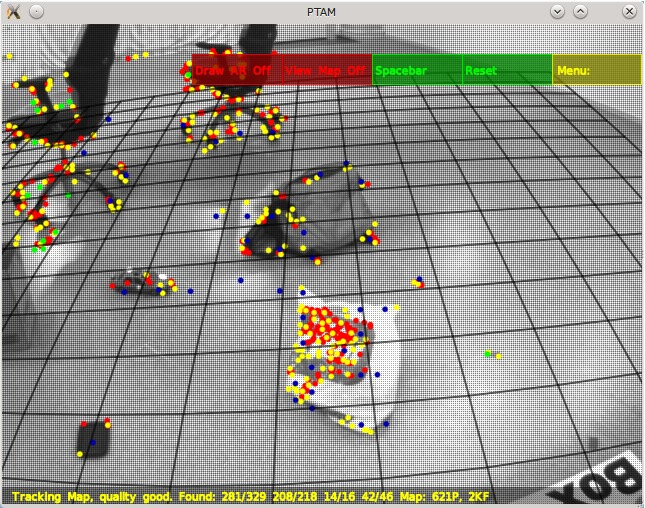

# Camera-based SLAM
{: .left}
The camera based SLAM uses the same implementation of monocular SLAM that I used in my master's thesis. 
While the algorithms were unable to run on the limited hardware available on the quadrotor in that thesis,
a dedicated Odroid U2 should do the work just fine.

The camera is mounted facing backwards, as it will enable features to stay in view for a longer period of time.

{: .right}
The SLAM algorithm used, PTAM, uses a multithreaded approach for performing a 
semi-offline feature mapping optimization while maintaining the online localization at full camera framerate.

