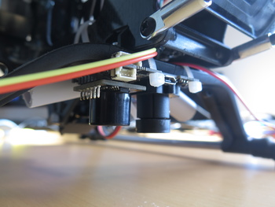

# Optical Flow
{: .right}
Facing the ground, these sensors can give an accurate reading of the velocities of the helicopter.
It is however sensible to both the orientation and the altitude of the helicopter, so any readings
must be compensated with accurate readings of these factors. As with all vision-based sensors,
obstacles and varying ground levels will pose a problem to this sensor, yielding inaccurate readings which
may confuse the localization. This sensor should be trusted with care!
