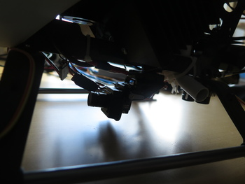

# Video Link
{: .left}
The video link can be used to spectate the flight. This is entirely 
decoupled from the data processing, and can therefore be used even if the computers go down,
or for manual flight.
