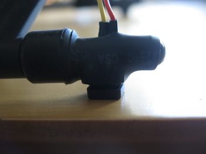

# Tactile Switches
{: .left}
Tactile switches are used to, with high confidence, detect ground contact.
This information is binary in its nature and is as such not very suitable for inclusion
in the continuous localization filter. After some initial filtering, it is however very suitable for
determining e.g. state transitions in the system.
