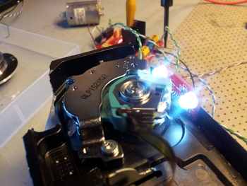

# Other Projects
Boy, do I have lots of stories to tell!

{: .left}
Like when we wanted to do a laser projector =).
We got two harddrives and used the read arms to control mirrors on which
we pointed a laser. By moving the mirrors would create patterns on the wall!
We never got it to look very good, but hey we only gave it a couple of nights' work!

Have a look at the other pages here for more examples of great projects I have been involved in!
