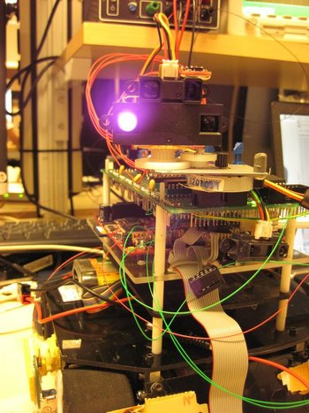

# Berit
{: .right}
Berit was probably the first of the robots me and my friend got together building.
It was made as a part of a big electronics project in the third year of university, which all student
of electrical engineering do (and has been doing for many years).

Berit is a mapping robot, i.e. it drives around an enclosed area and draws a map of the area.
While many approaches for this project is to drive around tracing the walls, we thought
it would be way cooler if it were to free-roam the area and scan the area 
with a 360-degree rotating turret with an IR distance sensor attached.
How hard could that be? Well, it turned out we pulled it off!
Even minutes before the final examination, we still hadn't gotten it to work yet, but
with just seconds to go, it got going - and everything worked!
We had actually worked so hard, and made it so well, that the examiner reported it to be
**the most advanced robot in the history of the course**. 
