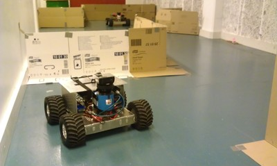

# Mine Robots
{: .left}
These are robots that I built for [Combitech](http://combitech.se/) while still at the university.
These monsters could climb on walls! In fact, it turned out they even needed to change the wheels later,
to avoid destroying the engines with their great grip.

In fall 2012, I led a cooperation between Combitech and Linköping's university to develop these robots further,
extending it to an ecosystem of robots which could drive around in the same area without collision.
Since this was a corporate cooperation, I am unable to give out the details, but I got to write some **really
interesting AI for this vehicle coordination!**

While working on these robots, I also got the oppurtunity to gain some experience on the pros and cons of LIDAR localization.
