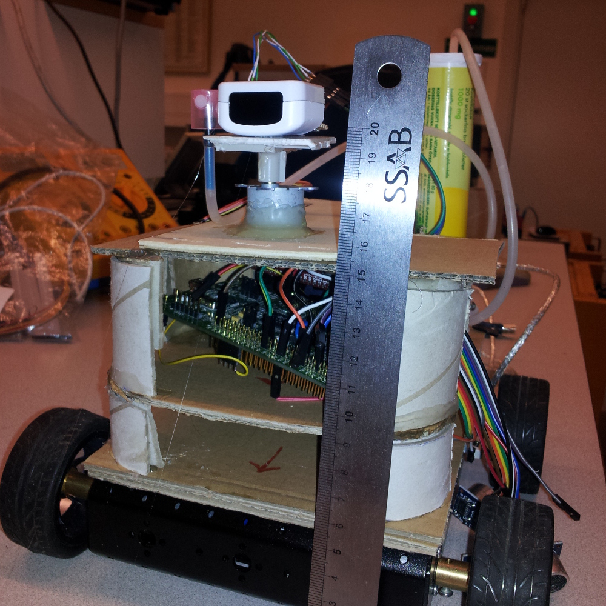

# Fire Fighter
{: .right}
A while back, a friend of mine was involved in setting up a local competition 
for the youth world cup of robotics.
One of the competition classes were for fire fighting robots. 
In a small maze, we were to localize a burning candle and put it out.

So, with just weeks to go, we decided to go all in! We worked lots of nights 
(and some days as well, where we had any) and got together a robot that used
the IR camera in a disassembled wiimote to localize a drive up to a candle.
It then started a small pump to spray water onto the candle to put it out!

In the end, we got short on time and never got to finish the robot entirely,
but I will always look on this project and remember the **magnificent team of 
great people we had!**
