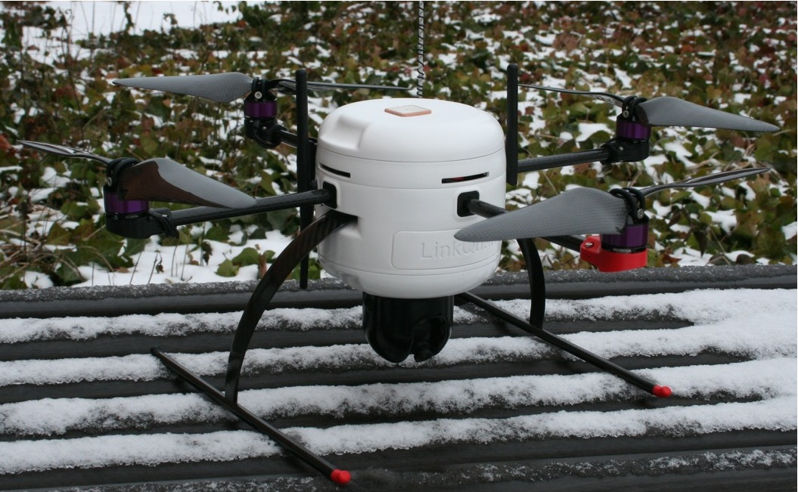

# Master's Thesis
Towards Autonomous Landing of a Quadrotor using Monocular Slam Techniques, my thesis is called.

{: .right}

For my thesis, I really wanted to use my knowledge of automatic control and state estimation, so what could
be better than a ready-to-use quadrotor and a state-of-the-art [Vicon motion capture room](http://www.vicon.com/)?

In retrospect I set out with really high ambitions, but in the end it turned out to 
be a working environment poisoned by my examiner's envy against my primary university department (ISY),
so I kind of got caught in the middle of a bad relation which majorly hurt both me and my thesis.

Nevertheless, I managed to finish my thesis on time. Since the quadrotor had nowhere 
near the specs required to perform camera-based SLAM, the implementation was made and as far as possible verified
my own working station. In the end, we got some interesting results, and I learned many lessons from this period of my life!

To facilitate such advanced methods as monocular slam and localization, I had to propose an improved state estimation method
for the quadrotor (introducing the team to Kalman filters). So, while it is very ambitious and so much more, it is also an good write-up on the 
different components needed in a more advanced UAV - observer, controller, state machines etc. - and their underlying theory.

If you are interested, you can [download my thesis](MastersThesis_JonatanOlofsson.pdf) and have a look for yourself!
